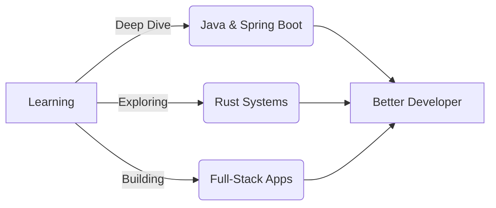

<div align="center">
  
</div>

<div align="center">
  
</div>

<div align="center">
  
  
</div>

<br>


## 👨‍💻 About Me

```typescript
const houda = {
    location: "Morocco 🇲🇦",
    role: "Full-Stack Developer",
    currentFocus: "Building scalable applications with Java",
    openTo: "Collaboration and new opportunities",
    motto: "Code, Learn, Repeat 🔄"
};
```

<br clear="right"/>

- 💻 Passionate about **clean code** and **scalable architecture**
- ☕ Currently deep diving into **Java** and **Spring Boot**
- 🔐 Most repositories are **private** (working on cool stuff!)
- 🌱 Always **learning** and exploring new technologies
- 🤝 Open to **collaborations** on interesting projects
- ⚡ Fun fact: I speak **multiple programming languages** fluently

<br>

---

## 🛠️ Tech Stack & Tools

<div align="center">

### 💡 Programming Languages

<p>
  
</p>


### 🎨 Frontend Development

<p>
  
</p>


### ⚙️ Backend & Databases

<p>
  
</p>


### 🔧 DevOps & Tools

<p>
  
</p>


</div>

---

## 📊 GitHub Statistics

<div align="center">
  
</div>

<div align="center">
  
  
</div>

---

## 🚀 Featured Projects

<div align="center">

| Project | Description | Tech Stack |
|---------|-------------|-----------|
| 🔢 **0-Shell** | A minimalist Unix-like shell implemented in Rust |  |
| 🎮 **GraphQL Profile** | Interactive profile page built with GraphQL |  |
| 📊 **Social Network** | Facebook-like social network platform |  |

</div>

<div align="center">
  <i>💡 More exciting projects coming soon! Most of my work is in private repositories.</i>
</div>

---

## 📈 Contribution Graph

<div align="center">
  
</div>

---

## 🎯 Current Focus

<div align="center">



</div>

---

## 📫 Let's Connect!

<div align="center">
  
[](https://github.com/houdajeon)
[](https://www.linkedin.com/in/houda-hdili-974779306/)
[](houdahdili2003@gmail.com)
[](#)

</div>

<div align="center">
  
</div>

---

<div align="center">
  
### 💭 Developer Quote of the Day
  
*"Code is like humor. When you have to explain it, it's bad."* – Cory House

</div>

  
**💡 "Let's build something great together!"**

Made with ❤️ and ☕ by Houda

⭐ From [houdajeon](https://github.com/houdajeon)

</div>
